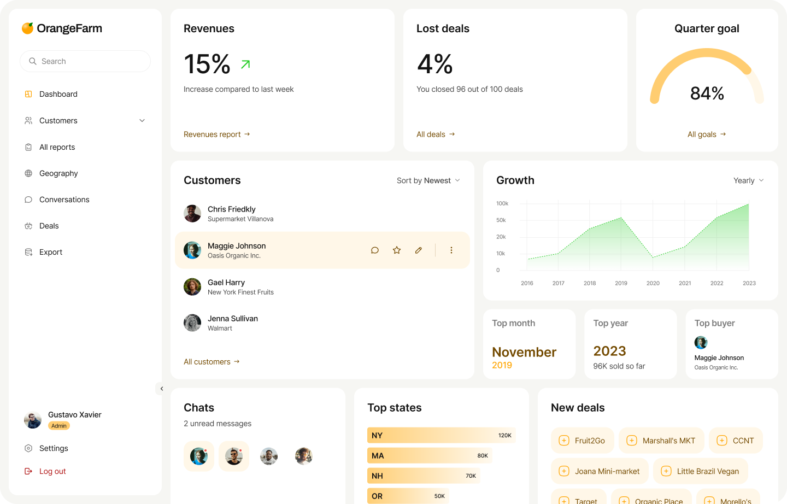

# 📊 Dashboard UI - OrangeFarm

A modern and responsive dashboard UI built with React and powerful libraries like MUI, ApexCharts, and React Table.

---

## 🚀 Features

- 📌 Sidebar navigation with icons
- 🎯 Dashboard cards (Revenue, Lost Deals, Quarter Goal)
- 📈 Interactive charts using ApexCharts
- 📊 Data table with React Table
- 👥 Customers list
- 💬 Chat preview
- 🌍 Top states analytics
- 🆕 New deals section
- ⚡ Smooth animations with Framer Motion
- 🎨 Clean and modern UI with MUI

---

## 🧠 Key Concepts Used

- Component-based architecture
- Reusable UI components
- State management (React Hooks)
- Conditional rendering
- Dynamic data mapping
- Animation handling with Framer Motion
- Clean folder structuring

---

## 🛠️ Tech Stack

- React.js
- MUI (Material UI)
- ApexCharts
- React Table
- Tailwind CSS
- Framer Motion
- Lucide React Icons

---

## 📁 Folder Structure

```bash
REACT DASHBOARD/
├── node_modules/             # Project dependencies
├── public/                    # Static assets (favicons, etc.)
├── src/                       # Main source code
│   ├── assets/                # Images and media
│   │   ├── admin.png
│   │   └── Logomark.png
│   ├── component/             # Reusable UI components
│   │   ├── sidebar/           # Sidebar specific components
│   │   │   ├── Logout.jsx
│   │   │   ├── Sidebar.jsx
│   │   │   ├── SidebarCatagory.jsx
│   │   │   ├── SidebarFooter.jsx
│   │   │   ├── SidebarInput.jsx
│   │   │   ├── SidebarLogo.jsx
│   │   │   ├── SidebarSetting.jsx
│   │   │   └── SidebarUser.jsx
│   │   ├── Stats-Cards/       # Dashboard card components
│   │   │   ├── Lost deals/    # Components for Lost Deals card
│   │   │   │   ├── AllDeals.jsx
│   │   │   │   ├── LostDeals.jsx
│   │   │   │   ├── LostDealsHeader.jsx
│   │   │   │   ├── LostDealsParcentage.jsx
│   │   │   │   └── LostDealsText.jsx
│   │   │   ├── Quarter goal/  # Components for Quarter Goal card
│   │   │   ├── Revenues/      # Components for Revenues card
│   │   │   │   ├── Revenus.jsx
│   │   │   │   ├── RevenusHeader.jsx
│   │   │   │   ├── RevenusParcentage.jsx
│   │   │   │   ├── RevenusReport.jsx
│   │   │   │   └── RevenusText.jsx
│   │   │   └── StatsCard.jsx  # Generic wrapper for stats
│   ├── App.jsx                # Main App component
│   ├── index.css              # Global styles
│   └── main.jsx               # Project entry point
├── .gitignore                 # Files to ignore in Git
├── eslint.config.js           # Linting rules
├── index.html                 # HTML template
├── package-lock.json          # Dependency lock file
├── package.json               # Scripts and dependencies
├── README.md                  # Project documentation
└── vite.config.js             # Vite configuration
```

---

## 🎨 UI Highlights

- Clean card-based layout
- Soft color palette with subtle shadows
- Interactive hover states
- Smooth transitions and animations
- Balanced spacing and typography

---

## 📊 Dashboard Sections

- **Revenues Card** → Weekly performance tracking
- **Lost Deals** → Conversion insights
- **Quarter Goal** → Progress visualization
- **Growth Chart** → Yearly analytics
- **Customers** → Client overview
- **Top States** → Regional performance
- **Chats** → Communication preview
- **New Deals** → Recent activities

---

## 🔥 Performance Focus

- Optimized component rendering
- Lightweight animations
- Clean and maintainable code
- Scalable architecture

---

## 🧩 Reusability

All UI parts are built as reusable components:
- Cards
- Sidebar items
- Table rows
- Chart sections

This makes the project scalable for future features.

---

## 📸 Preview



---

## 🧑‍💻 Author

**Shahariar Ahammad Fahim**

---

## 📄 License

This project is licensed under the MIT License.