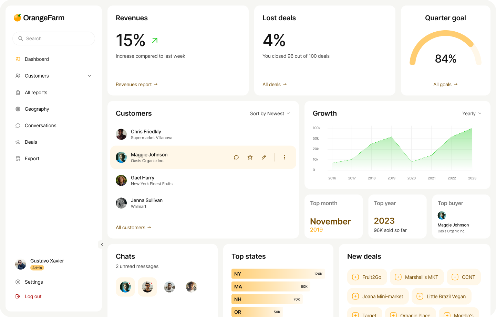

# 📊 Dashboard UI - OrangeFarm

A modern and responsive dashboard UI built with React and powerful libraries like MUI, ApexCharts, and React Table.

---

## 🚀 Features

- 📌 Sidebar navigation with icons
- 🎯 Dashboard cards (Revenue, Lost Deals, Quarter Goal)
- 📈 Interactive charts using ApexCharts
- 📊 Data table with React Table
- 👥 Customers list
- 💬 Chat preview
- 🌍 Top states analytics
- 🆕 New deals section
- ⚡ Smooth animations with Framer Motion
- 🎨 Clean and modern UI with MUI

---

## 🧠 Key Concepts Used

- Component-based architecture
- Reusable UI components
- State management (React Hooks)
- Conditional rendering
- Dynamic data mapping
- Animation handling with Framer Motion
- Clean folder structuring

---

## 🛠️ Tech Stack

- React.js
- MUI (Material UI)
- ApexCharts
- React Table
- Tailwind CSS
- Framer Motion
- Lucide React Icons

---

## 📁 Folder Structure

```bash
REACT DASHBOARD/
src/
├── assets/                 # Images, Icons, Logos (e.g., Logomark.png, c1.png)
├── component/              # Reusable Components
│   ├── sidebar/            # Sidebar specific components
│   │   ├── Sidebar.jsx
│   │   ├── SidebarLogo.jsx
│   │   ├── Sidebarinput.jsx
│   │   ├── SidebarCatagory.jsx
│   │   └── SidebarFooter.jsx
│   ├── Stats-Cards/        # Top Revenue/Goal cards
│   │   ├── StatsCard.jsx
│   │   ├── Revenues/       # Sub-folder for complex parts
│   │   │   ├── Revenus.jsx
│   │   │   └── RevenusHeader.jsx
│   │   ├── Lost-deals/
│   │   └── Quarter-goal/
│   ├── Customer/           # Customer section
│   │   ├── Customer.jsx
│   │   ├── CustomerHeader.jsx
│   │   └── CustomerList.jsx
│   ├── Growth/             # Growth section
│   │   ├── Growth.jsx
│   │   └── GrowthChart.jsx
│   ├── Top-cards/          # Yellow cards (Month, Year, Buyer)
│   │   ├── TopCards.jsx
│   │   ├── TopMonth.jsx
│   │   ├── TopYear.jsx
│   │   └── TopBuyer.jsx
│   ├── Chats/              # Chat section
│   │   ├── Chats.jsx
│   │   └── People.jsx
│   ├── Top-States/         # States section
│   │   ├── TopStates.jsx
│   │   └── TopStateGraph.jsx
│   └── New-deals/          # Deals section
│       ├── NewDeals.jsx
│       └── NewDealsBody.jsx
├── App.jsx                 # Main Layout/Grid setup
├── main.jsx                # Entry point
└── index.css               # Tailwind & Global styles
```

---

## 🎨 UI Highlights

- Clean card-based layout
- Soft color palette with subtle shadows
- Interactive hover states
- Smooth transitions and animations
- Balanced spacing and typography

---

## 📊 Dashboard Sections

- **Revenues Card** → Weekly performance tracking
- **Lost Deals** → Conversion insights
- **Quarter Goal** → Progress visualization
- **Growth Chart** → Yearly analytics
- **Customers** → Client overview
- **Top States** → Regional performance
- **Chats** → Communication preview
- **New Deals** → Recent activities

---

## 🔥 Performance Focus

- Optimized component rendering
- Lightweight animations
- Clean and maintainable code
- Scalable architecture

---

## 🧩 Reusability

All UI parts are built as reusable components:
- Cards
- Sidebar items
- Table rows
- Chart sections

This makes the project scalable for future features.

---

## 📸 Preview



---

## 🧑‍💻 Author

**Shahariar Ahammad Fahim**

---

## 📄 License

This project is licensed under the MIT License.